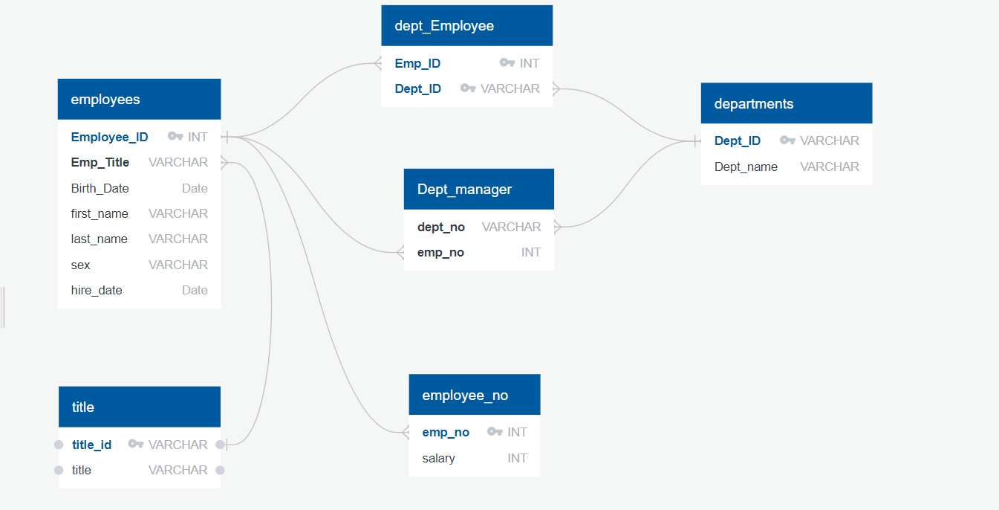

# Employee-Data-Analysis-with-SQL
An organisation's database contains 6 datasets with information about its employee demogs, salaries, titles accross all departments. Project exhibits use of SQL and python integratively for data engineering, analysis and visualisation. 

## Narrative
1. Performed Data Engineering to create a table schema for each of the six CSV files, specified primary keys, foreign keys and other constraints.

2. After importing CSV's into postgreSQL, analysed data using SQL queries like inner joins, order by, group by. 
3. Created certain Data visualisations in python using SQL alchemy to import data in pandas dataframe.

## Tools and technologies used and required to run the project

* PostgreSQL
* SQL queries
* Quick DBD (https://app.quickdatabasediagrams.com/#/)
* Pyhton:-
    - Libraries:- Pandas, Matplotlib, SQLAlchemy

## How to Run the Code

1. Download all the csv files from the data folder and bonus.ipynb
2. Open up PostgreSQL.
3. Create a new database called "employees_db".
4. Open up the query editor for the database you just created.
5. Copy code from Employye-SQL\data_engg.sql file and run in the query editor.
6. Import CSV's in corresponding postgreSQL table.
7. Clear the query editor
8. Copy code from  Employye-SQL\data_analysis.sql. Run each query one at a time to view resultant table
9. In jupyter notebook, open the bonus file and enter your password for postgreSQL at the prompt in first cell.
10. At the top, under the "Kernal" tab, click "Restart & Run All". This will run all the cells on the page and display all the dataframes graphs.

## Output

1. QuickDBD diagram showing relation between tables

2. Example of a SQL queried report
 

3. Salary Range Histogram

4. Average Salar per Title bar graph

